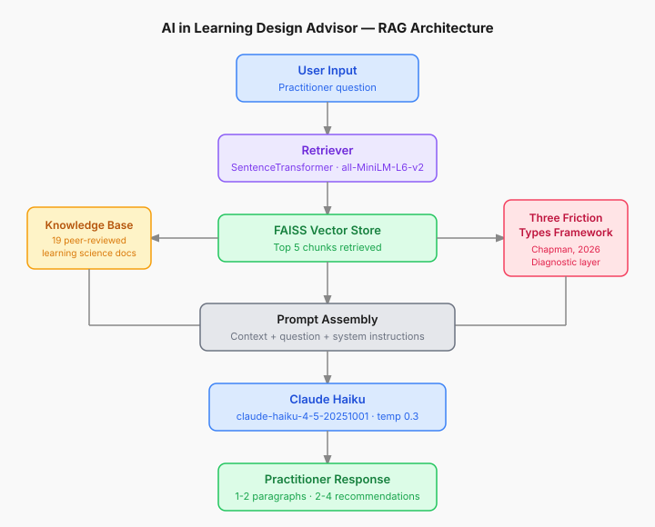

# Project 1 Report: AI in Learning Design Advisor
**Natasha Chapman, PhD**
Building Agentic AI Applications for Beginners, Codecademy, 2026

---

## Overview

The AI in Learning Design Advisor is a retrieval-augmented generation (RAG) chatbot designed for learning and training professionals. It helps practitioners reason about their design decisions -- specifically, how and where AI belongs in a given learning context.

The tool is grounded in two sources of knowledge: a curated set of learning science research and practitioner frameworks and a proprietary diagnostic framework, the Three Friction Types Framework (Chapman, 2026). That combination is what distinguishes it from a general-purpose AI assistant. A practitioner asking the same question to ChatGPT gets advice drawn from everything; this advisor draws from a specific, bounded knowledge base and applies a practitioner-developed lens to the response.

The live application is deployed at [ai-learning-design-advisor.streamlit.app](https://ai-learning-design-advisor.streamlit.app). The source code and data are available at [github.com/nhchapman05/ai-learning-design-advisor](https://github.com/nhchapman05/ai-learning-design-advisor).

---

## Architecture

The system uses a standard RAG pipeline built on LangChain with a `stuff` chain -- retrieved document chunks are passed directly into the prompt context window alongside the user's question. No summarization or map-reduce step is used; the context window of Claude Haiku is large enough to handle the retrieved chunks without compression.

The pipeline runs as follows:

1. The user submits a question through the Streamlit chat interface
2. The query is encoded using SentenceTransformer embeddings and passed to the FAISS vector store
3. The retriever returns the top 5 most semantically similar chunks from the indexed knowledge base
4. Those chunks, along with the user's question and the system prompt, are assembled into a single prompt
5. Claude Haiku generates a response following the constraints and examples in the system prompt
6. The response and source documents are displayed in the UI

The system prompt includes the Three Friction Types Framework as explicit diagnostic context, instructing the model to work through a silent diagnostic before responding. This means the framework shapes the reasoning without necessarily appearing as a named category in the output -- the practitioner sees a grounded recommendation, not a label.

See `architecture-diagram.svg` for a visual representation of this flow.

---

## Technical Choices

### LLM: Claude Haiku (claude-haiku-4-5-20251001)

Claude Haiku was selected for speed, cost efficiency, and strong instruction-following at small scale. The responses this tool needs to produce are relatively short and structured -- 1-2 paragraphs and 2-4 recommendations -- which does not require the reasoning depth of a larger model. Haiku handles this well at a fraction of the cost of Opus or Sonnet.

Anthropic's models were also preferred for their alignment properties. The tool is designed to give practitioners honest, grounded recommendations -- including when the answer is "AI does not belong here." A model less resistant to sycophantic drift would be a liability in that context.

Temperature is set to 0.3 to keep responses consistent and grounded. Higher temperature produced more variable output quality across identical queries.

### Embeddings: SentenceTransformer all-MiniLM-L6-v2

Anthropic does not offer a native embeddings API, which ruled out using Claude for both the generation and retrieval layers. SentenceTransformer's `all-MiniLM-L6-v2` was selected because it runs locally (no API cost), produces high-quality semantic embeddings for short-to-medium text, and is well-suited for the kind of conceptual similarity matching this tool requires -- a practitioner's question about "AI in coaching conversations" should surface chunks about human learning, transfer, and practice even if the exact words don't match.

### Vector Store: FAISS

FAISS was chosen for its simplicity and local operation. For a portfolio-scale project with 19 documents and 1,000+ chunks, a managed vector database like Pinecone would add cost and infrastructure complexity without meaningful performance gains. FAISS loads and queries fast enough for this use case, and it runs in-memory without a separate service.

### Framework: LangChain + langchain-classic

LangChain's `RetrievalQA` chain provided the fastest path to a working pipeline. The `langchain-classic` package was required because the standard `langchain.chains` module had a missing dependency in the Colab environment. This is a known compatibility issue and would be resolved in a production environment.

---

## Knowledge Base

The knowledge base contains 19 documents: 18 PDFs and 1 Markdown file. Documents were selected for direct relevance to the tool's diagnostic purpose -- learning science research that an L&D practitioner would cite when making design decisions. General AI or technology documents were excluded intentionally.

Sources include:

- Pearson Learning Design Principles series (6 volumes covering cognitive load, authentic learning, motivation, objective design, digital learning, and developing understanding)
- Mayer's 12 Principles of Multimedia Learning
- Khosravi et al. (2026), *Building AI Companions that Prioritise Learning over Performance*
- Hardman newsletters on AI and learning design (3 pieces)
- AACE (2026), *Generative AI for Instructional Design*
- CESE Cognitive Load Theory (research and practice editions)
- US Department of Education, *AI and the Future of Teaching and Learning* (2023)
- Illinois Best Practices for Teaching and Learning with GenAI
- Chapman, N. (2026), *Three Friction Types Framework* (proprietary, Markdown)

Chunking strategy: `chunk_size=1000`, `chunk_overlap=200`. This produced 437 raw chunks and 1,025 splits across all documents.

---

## Prompt Engineering

The system prompt uses XML structure with explicit sections for instructions, response principles, and few-shot examples. Key design decisions:

**Practitioner-type reading.** The prompt instructs the model to identify where the practitioner is coming from before responding -- skeptical, uncertain, or already using AI. This routes the response from the practitioner's starting point rather than a generic position.

**Silent diagnostic.** Before drafting a response, the model is instructed to work silently through the Three Friction Types diagnostic: what kind of friction is at stake, and what role does AI play given that diagnosis? The framework shapes the reasoning without appearing as a label in the output.

**Few-shot examples.** Three examples demonstrate the expected response format: one practitioner type each (skeptic, uncertain adopter, lost). The examples were calibrated to show the upper bound of response length -- 2 paragraphs and 3-4 recommendations -- with the instruction that most responses should be shorter.

**Constraint language.** Response principles include an explicit length constraint (1-2 paragraphs, no exceptions), a recommendation ceiling (2-4, never more than four), and a rule against opening with empty validation.

One key learning from this project: few-shot examples carry more weight than instruction language. Early iterations specified "no more than two paragraphs" in the instructions but showed examples with three -- the model consistently produced three. Fixing the examples resolved the issue. Instructions set the rule; examples set the behavior.

---

## Evaluation

### Does the RAG component work?

Yes. Responses consistently reference concepts and framing that appear in the knowledge base documents -- including the Three Friction Types Framework -- rather than drawing on general training data. The same questions posed to a general model (tested against Gemini) produce noticeably different responses.

### Comparison with Gemini

When the performance management coaching question was posed to Gemini, the response focused on change management facilitation tactics: stakeholder buy-in, communication strategies, rollout planning. When posed to this advisor, the response focused on learning design diagnosis: identifying which parts of the training involve growth friction (the coaching conversation) versus where AI can substitute (content creation, scenario generation, low-stakes drills). The difference reflects the knowledge base and the diagnostic framework -- not just a different model.

This is the differentiator the tool is designed to demonstrate. The question is not "what should I do?" but "what kind of learning problem do I have, and what does that mean for how AI fits?"

### What is working

- The friction framework surfaces reliably in responses, including the key distinction between protecting growth-oriented cognitive work and removing administrative overhead
- Response format generally holds to the constraints (1-2 paragraphs, 2-4 recommendations)
- Tone is consistently collegial and practitioner-facing -- it reads like advice from a knowledgeable peer, not a chatbot
- The tool handles genuinely complex scenarios (AI in coaching conversations, proactive AI policy design for courses) with nuanced, grounded recommendations

### Known limitations

**Source diversity.** The retriever consistently surfaces chunks from a single source document per query, even with `k=5`. The five retrieved chunks likely score from one high-similarity document, leaving the rest of the knowledge base underrepresented in any given response. A hybrid search approach (semantic + keyword) or MMR (maximum marginal relevance) retrieval would improve diversity.

**Single-word inputs.** Short or vague queries produce weak retrieval. The tool is designed for practitioner-level questions with enough context to retrieve meaningfully. This is a design constraint, not a bug, but worth noting.

**Multi-turn context.** Conversation history is displayed within a session but is not consistently passed into the retrieval chain. The model may or may not draw on earlier turns depending on how the user phrases follow-up questions. Explicitly passing conversation history into the prompt context is the fix, and a priority for the next iteration.

---

## Future Enhancements

**Multi-agent architecture.** The current implementation is a single-chain RAG advisor. The intended future state is a multi-agent system with a Diagnostic Agent (reads the practitioner's question and classifies the friction type), a Reasoning Agent (pulls from the knowledge base and applies the framework), and an Output Agent (formats the recommendation). This architecture would produce more auditable and consistent responses.

**Governance Creator.** A second mode or sub-agent focused on helping organizations build AI governance language for their learning programs, drawing on UNESCO AI frameworks, NIST AI RMF, and EU AI Act. This would shift the tool from practitioner-facing advice to organizational policy support.

**Expanded and diversified knowledge base.** Additional research sources, practitioner case studies, and institutional AI policies would deepen the retrieval pool and reduce the current single-source retrieval problem.

**Persistent memory.** Cross-session conversation history so the advisor can build context with a returning practitioner -- tracking what they've tried, what their organization's constraints are, and what problems they're returning to.

**Improved retrieval.** MMR or hybrid search to surface more diverse sources per query. Re-ranking to prioritize chunks that are both relevant and distinct from each other.

---

## Reflection

This project is the first working layer of a larger product I am developing through Lit Learning LLC: a practitioner-facing diagnostic tool that helps learning teams reason about where AI belongs in their design process and where it doesn't.

The technical build was secondary to the design problem. The harder work was defining the diagnostic framework, curating the knowledge base, and engineering a system prompt that produces grounded, practitioner-facing recommendations rather than generic AI advice. The RAG architecture makes that possible -- it constrains the model to a specific body of knowledge and a specific reasoning lens. That constraint is the product.

The biggest technical learning was about how LLMs process prompts: few-shot examples dominate instruction language. Knowing that changes how I approach prompt engineering -- if you want a specific behavior, show it, don't just say it.
